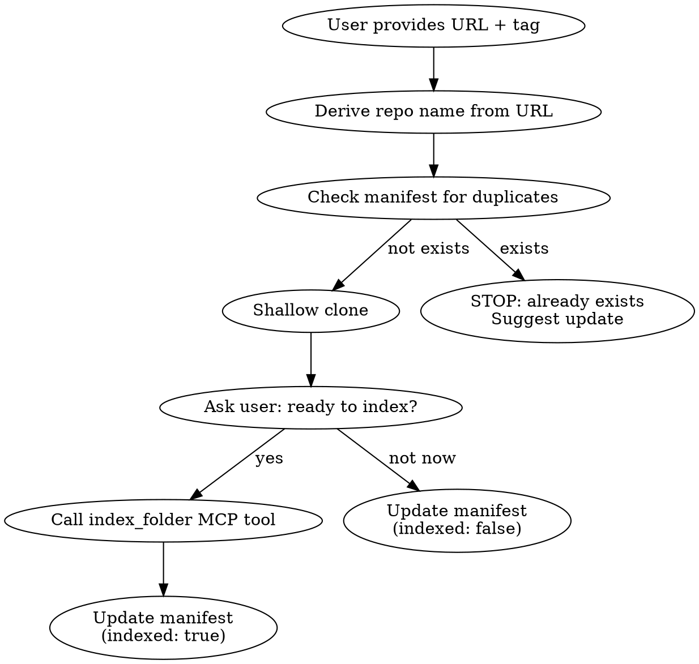

# Manage Local MCP Repositories

Manage jCodeMunch shallow clones and indexes in `.local-mcp/`. User provides repo URL + tag, Claude handles cloning, indexing, and lifecycle.

## Directory Layout

```
.local-mcp/
├── manifest.json   # Tracks repos, tags, index status
├── repos/          # Shallow git clones
│   └── <name>/     # e.g. rdkit/
└── indexes/        # jCodeMunch index storage (CODE_INDEX_PATH)
```

## Operations

### Add a Repository

User provides: **repo URL** and **git tag**.



**Steps:**

1. Derive `<name>` from repo URL (last path segment, minus `.git`)
2. Check `.local-mcp/manifest.json` — if name exists, suggest `update` instead
3. Clone:
   ```bash
   git clone --depth 1 --branch <tag> <url> .local-mcp/repos/<name>
   ```
4. Ask user: _"Repository cloned. Ready to index with jCodeMunch?"_
5. If yes — use jCodeMunch MCP tool `index_folder`:
   - `path`: absolute path to `.local-mcp/repos/<name>`
   - `use_ai_summaries`: false (keep it fast, no API keys needed)
   - `incremental`: false (first index)
6. Update manifest (see Manifest Format below)

### Update a Repository Tag

User provides: **repo name** and **new tag**.

**Steps:**

1. Verify repo exists in manifest
2. Remove old clone:
   ```bash
   rm -rf .local-mcp/repos/<name>
   ```
3. Invalidate jCodeMunch cache — use MCP tool `invalidate_cache` with the repo identifier from manifest
4. Re-clone at new tag:
   ```bash
   git clone --depth 1 --branch <new-tag> <url> .local-mcp/repos/<name>
   ```
5. Ask user: _"Cloned at new tag. Ready to re-index?"_
6. If yes — call `index_folder` as in Add flow
7. Update manifest with new tag and index timestamp

### Remove a Repository

User provides: **repo name**.

**Steps:**

1. Verify repo exists in manifest
2. Remove clone:
   ```bash
   rm -rf .local-mcp/repos/<name>
   ```
3. Invalidate jCodeMunch cache — use MCP tool `invalidate_cache`
4. Remove entry from manifest

### List Repositories

No user input needed.

**Steps:**

1. Read `.local-mcp/manifest.json`
2. Optionally call jCodeMunch `list_repos` MCP tool for index details
3. Present table:

| Name | Tag | URL | Indexed | Index Date |
|------|-----|-----|---------|------------|

## Manifest Format

File: `.local-mcp/manifest.json`

```json
{
  "repos": [
    {
      "name": "rdkit",
      "url": "https://github.com/rdkit/rdkit.git",
      "tag": "Release_2025_09_6",
      "cloned_at": "2026-03-15T10:00:00Z",
      "indexed": true,
      "indexed_at": "2026-03-15T10:05:00Z",
      "jcodemunch_repo_id": "local/rdkit-a1b2c3d4"
    }
  ]
}
```

- `jcodemunch_repo_id`: returned by `index_folder` response (`repo` field) — needed for `invalidate_cache` and symbol queries
- Create file if it doesn't exist (initialize with `{"repos": []}`)

## Using Indexed Repos

After indexing, Claude can query any repo via jCodeMunch MCP tools:

1. `get_repo_outline` — high-level overview
2. `get_file_tree` — browse structure
3. `get_file_outline` — symbols in a file
4. `search_symbols` — find functions/classes
5. `get_symbol` — retrieve exact source code

Use the `jcodemunch_repo_id` from manifest as the `repo` parameter.

## Notes

- `.local-mcp/` is gitignored — clones and indexes stay local
- `CODE_INDEX_PATH` is set to `./.local-mcp/indexes` in `.mcp.json`
- No API keys needed unless `use_ai_summaries: true` is requested
- Shallow clones keep disk usage minimal
